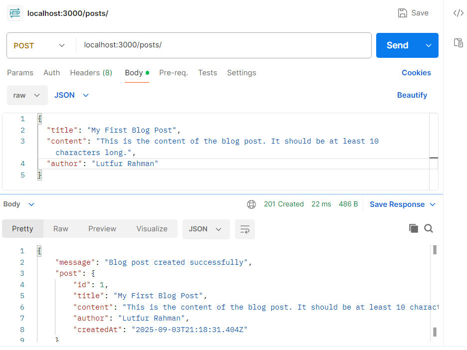
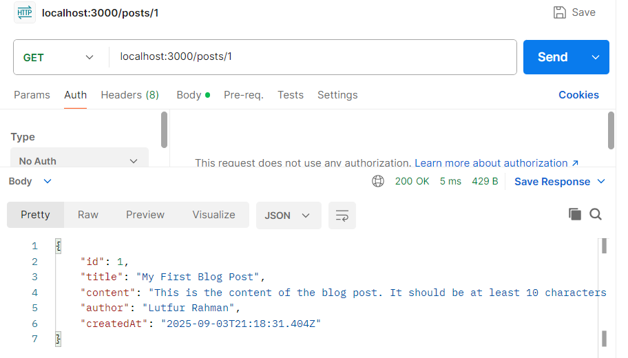
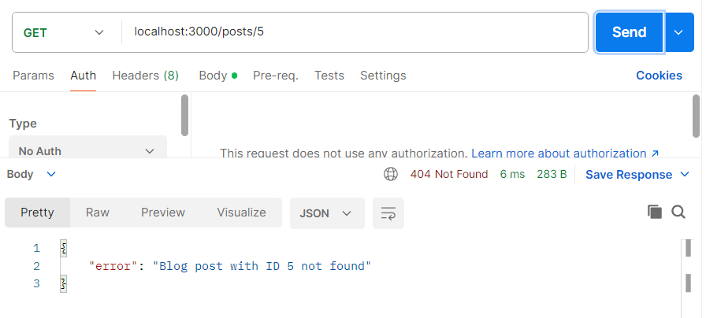

# Blog Post Server

A simple Express.js Server for managing blog posts. Posts are stored in memory and include validation using Joi.

## Prerequisites

- Node.js (v14 or higher)
- npm
- Joi

## Installation

1. Clone repo and Navigate to the project directory:

```bash
cd d:\Pocket\assignment-1
```

2. Install dependencies:

```bash
npm install express joi
```

## Running the Server

Start the server:

```bash
node app.js
```

Server will run on http://localhost:3000

## API Endpoints

### Create a Blog Post

**POST** `/posts`

**Request Body** (JSON):

- `title` (string, required, min 3 characters)
- `content` (string, required, min 10 characters)
- `author` (string, required)

**Example:**

```bash
curl -X POST http://localhost:3000/posts ^
  -H "Content-Type: application/json" ^
  -d "{\"title\":\"My First Post\",\"content\":\"This is my first blog post content.\",\"author\":\"John Doe\"}"
```

**Response:** 201 Created with post details

### Get a Blog Post by ID

**GET** `/posts/:id`

**Example:**

```bash
curl http://localhost:3000/posts/1
```

**Response:**

- 200 OK with post data
- 400 Bad Request for invalid ID
- 404 Not Found if post doesn't exist

## Testing

Use curl commands above, Postman, or any HTTP client. Remember to set `Content-Type: application/json` for POST requests.

## Notes

- Posts are stored in memory and will be lost when server restarts
- IDs are auto-incremented starting from 1
- All validation




